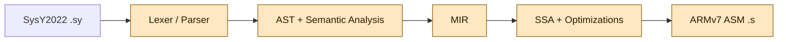
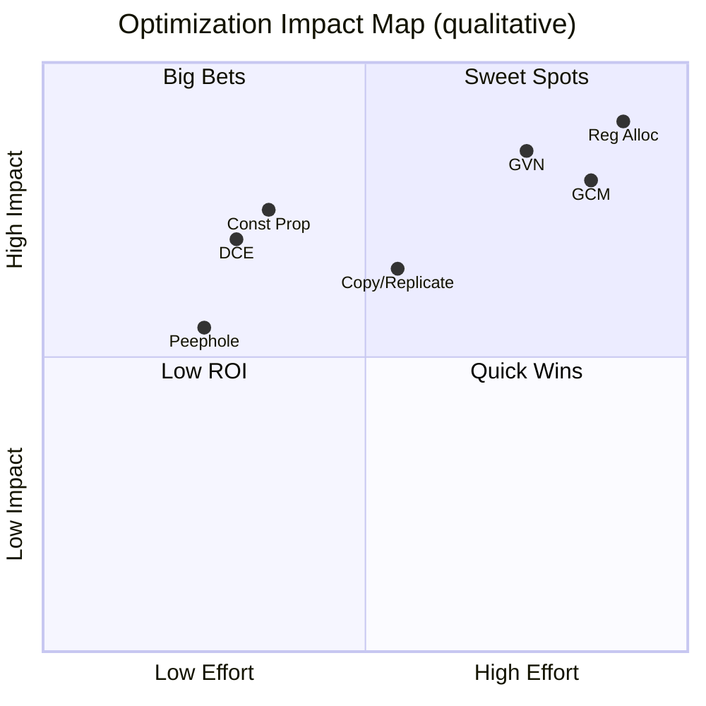

# SysY2022-ARMv7-Compiler


A SysY2022 to ARMv7 optimizing compiler built for the 2023 Compiler System Design contest (Bisheng Cup). The project emphasizes a clean end-to-end pipeline, solid IR/SSA-based optimization, and a practical backend that produces linkable ARMv7 assembly.

## Language Target: SysY2022
SysY2022 is a C subset with extensions used in the contest.

- Source files end in `.sy` and contain a single `main` plus optional globals and helper functions
- Types: `int` (32-bit signed) and `float` (32-bit IEEE single), plus multi-dimensional row-major arrays
- `const` supported; variables must be declared before use
- Statements: assignment, expression, block, `if`, `while`, `break`, `continue`, `return`
- Expressions: arithmetic, relational, logical with C-like precedence and short-circuiting
- Functions: `int`/`float` return types or `void`; arrays passed by address
- Implicit `int` <-> `float` conversion is allowed
- I/O and timing are provided by the SysY runtime library (`libsysy.a`): `getint`, `getfloat`, `putint`, `putfloat`, `putf`, `starttime`, `stoptime`, etc.

## My Contribution Flow
The graph below highlights the compiler stages I built and integrated.



## Optimization Highlights
- SSA construction with CFG-based passes
- Constant propagation, dead-code elimination, copy/replicate propagation
- Global value numbering and redundant computation removal
- Array motion and peephole cleanup
- Graph-coloring register allocation with spill handling

## Effect Map (Qualitative)
This chart is a qualitative view of where each optimization tends to land in impact vs. engineering effort.



## Build
```bash
cmake -S src -B build
cmake --build build -j
```

## Run
```bash
./build/compiler path/to/test.sy
# emits path/to/test.s
```

Enable extra optimization:
```bash
./build/compiler path/to/test.sy -O1
```

Link and run (ARMv7 cross toolchain + QEMU):
```bash
arm-linux-gnueabihf-gcc -march=armv7 path/to/test.s src/libsysy.a --static -o test.bin
qemu-arm test.bin < test.in > test.out
```

## Repo Layout
- `src/frontend` : lexer/parser (Flex/Bison) and front-end glue
- `src/structure/ast` : AST and semantic analysis
- `src/structure/mir` : MIR and ARMv7 code generation
- `src/backend` : SSA, CFG, optimizations, and register allocation
- `src/utils` : shared utilities

## Notes for Reviewers
- Target output is ARMv7 assembly (32-bit)
- Runtime library is linked statically via `src/libsysy.a`
- The compiler is designed as a clear, modular pipeline suitable for extension
